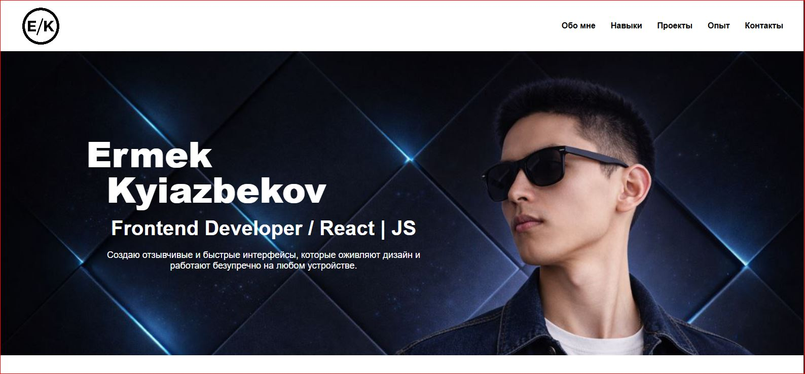

# 🚀 Сайт-портфолио

Адаптивный сайт-портфолио Frontend-разработчика с современным интерфейсом и чистой структурой кода.

## 📷 Скриншот

## 📌 О проекте

Проект разработан с использованием **HTML5** и **CSS3**.  
Реализована полностью адаптивная верстка, корректно отображающаяся на всех типах устройств — от смартфонов до широкоформатных мониторов.

Сайт включает:

- Главный экран (Hero section)
- Блок навыков
- Раздел с проектами
- Опыт работы
- Контактную информацию
- Версию для печати

## ⚙️ Технологии

- HTML5
- CSS3
- Flexbox
- CSS Grid
- Media Queries
- BEM-методология

## ✨ Особенности

- Полная адаптивность (Mobile / Tablet / Desktop / 4K)
- Семантическая разметка
- Чистая и структурированная организация стилей
- Hover-анимации и плавные переходы
- Оптимизация для печати (`@media print`)

## 🌍 Демо

[Открыть сайт](https://phenomenal-pixie-1949ea.netlify.app/)
